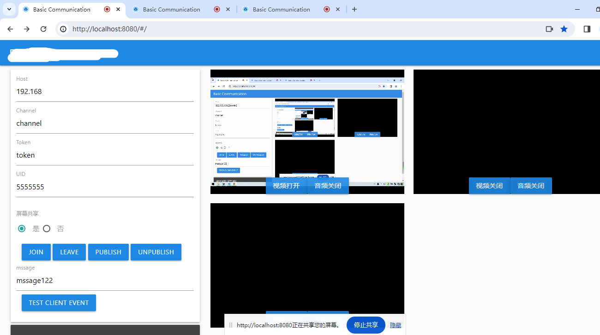
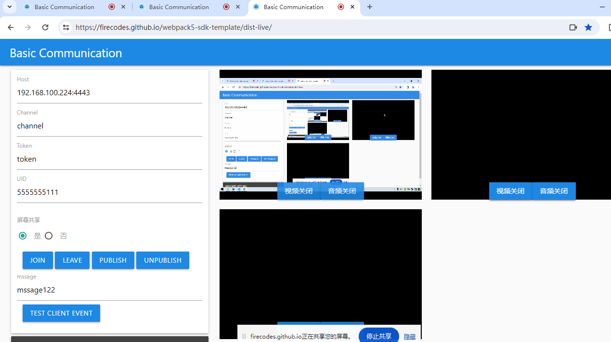

# 项目说明
 sdk打包工具， node_modules 依赖模块含有node语法，为兼容语法写的打包模板

# sdk 打包代码链接
 1. https://github.com/firecodes/webpack5-sdk-template/tree/page

# 页面链接 (打开浏览器控制台，看window全局变量)
 1. https://firecodes.github.io/webpack5-sdk-template
 2. https://firecodes.github.io/webpack5-sdk-template/dist/
 
## 技术

内置 Webpack5 + ES6 + Babel + sass+css

## Installation
Clone this repo and npm install.

```bash
npm i --force
```

## Usage

### Development server
```bash
npm start
```

### Production build

```bash
npm run build
npm run build:sdk
npm run build:ts:sdk
```
## 页面展示

- 直播1(mediasoup-server)



- 直播2(socket.io)



### 打包项目对比参考 (感谢)
1.  https://github.com/versatica/mediasoup-demo
2.  https://github.com/dvgis/dc-sdk
3.  https://github.com/taniarascia/webpack-boilerplate
4.  https://github.com/socketio/socket.io-client/tree/4.2.0
5.  https://github.com/videsk/webpack-library-template
6.  https://github.com/socketio/socket.io-client

### 打包工具对比（具体看项目对依赖包要求,选择合适打包)
1. browserify + babelify + gulp (参考 mediasoup-demo)
2. rollup  + gulp   (参考 dc-sdk、socket.io-client)
3. Webpack5   (参考 webpack )


# vitepress 编写sdk文档

```bash
npm run docs:dev
npm run docs:build
```


# 关于模块化(参考链接)
1. https://www.jianshu.com/p/36c4d4ee65f5
2. https://blog.csdn.net/qq_17175013/article/details/119753486
3. https://webpack.docschina.org/configuration/output/#outputlibrary
# esm, cjs, amd, umd
1. ES Modules (ESM):
2. CommonJS (CJS):
3. AMD (Asynchronous Module Definition):
4. UMD (Universal Module Definition):


